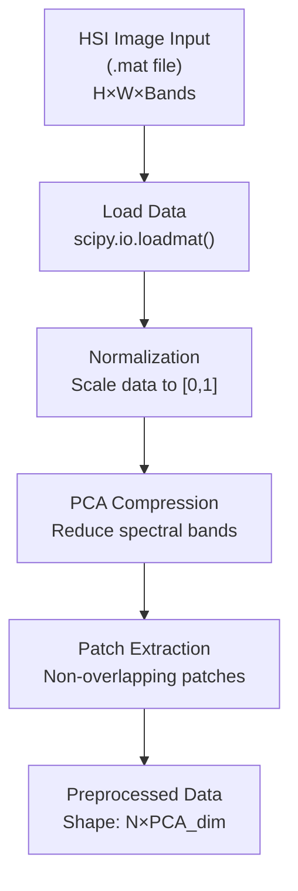
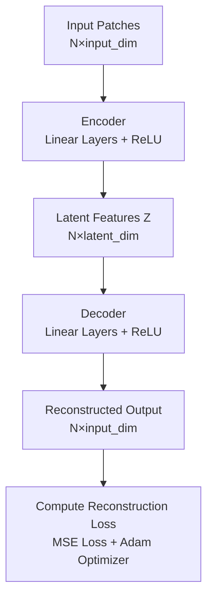
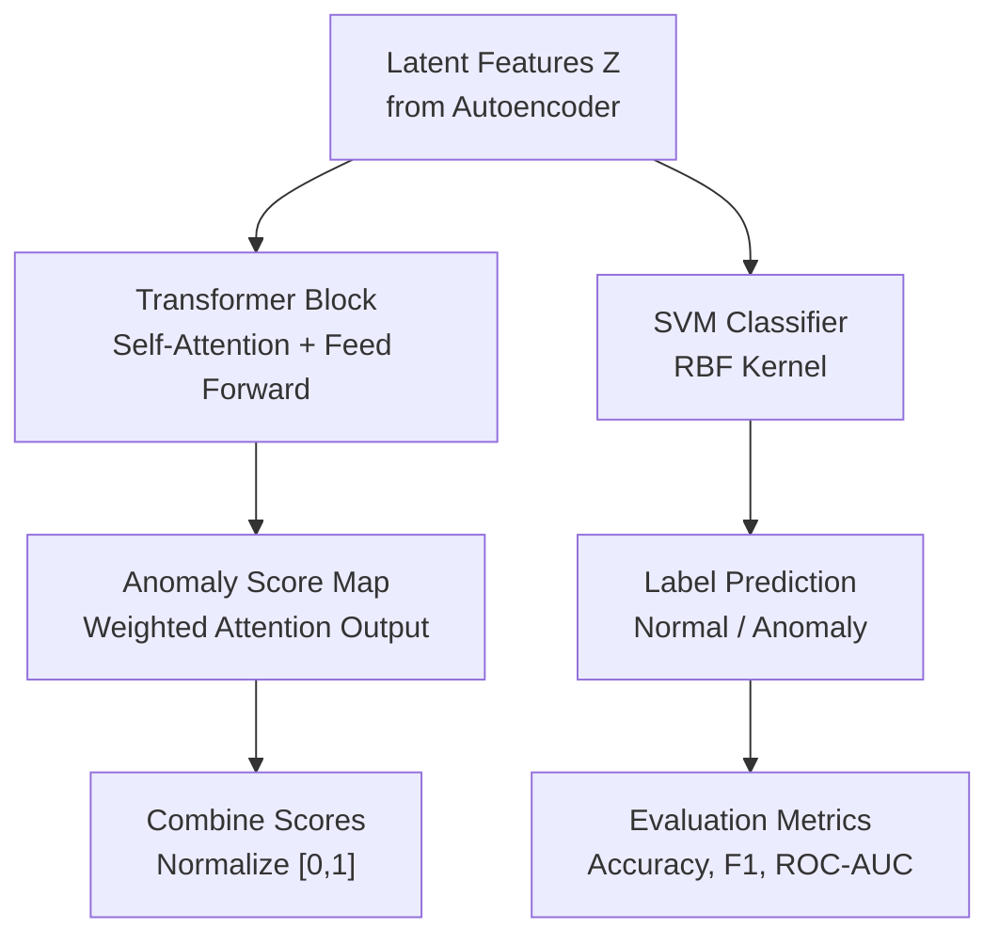
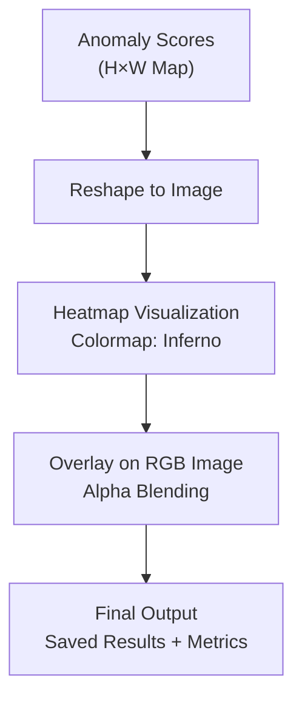

# HSI Anomaly Detection Model Architecture

## Overview
This document provides a comprehensive breakdown of the Hyperspectral Imaging (HSI) anomaly detection system architecture, showing how HSI images are processed through the pipeline to identify and classify anomalies.

## System Components

### 1. Data Input Layer
- **Input Format**: MATLAB (.mat) files containing hyperspectral data cubes
- **Data Structure**: 3D tensors of shape (Height × Width × Spectral Bands)
- **Ground Truth**: Separate .mat files with pixel-level class labels

### 2. Preprocessing Pipeline
- **Noise Removal**: Dataset-specific band filtering (e.g., Indian Pines: removes bands 104-108, 150-163, 220)
- **Normalization**: MinMaxScaler normalization (values scaled to [0, 1])
- **Dimensionality Reduction**: PCA (Principal Component Analysis)
  - Pavia: 30 components
  - Indian/Salinas: 40 components
- **Output**: Reduced HSI cube (H × W × PCA_components)

### 3. Patch Extraction Module
- **Patch Size**: Configurable (default: 16×16, classification uses 3×3 or 5×5)
- **Padding**: Reflect padding to handle boundary pixels
- **Spatial Context**: Extracts spatial-spectral patches maintaining spatial relationships
- **Output**: Flattened patches of shape (N_patches × patch_size² × PCA_components)

### 4. Autoencoder Architecture

#### Encoder Network
```
Input: Flattened Patch (patch_size² × PCA_components)
  ↓
Linear Layer: (input_dim → 512)
  ↓
ReLU Activation
  ↓
Linear Layer: (512 → latent_dim)
  ↓
Output: Latent Representation Z (latent_dim = 32)
```

#### Decoder Network
```
Input: Latent Representation Z (latent_dim = 32)
  ↓
Linear Layer: (latent_dim → 512)
  ↓
ReLU Activation
  ↓
Linear Layer: (512 → input_dim)
  ↓
Output: Reconstructed Patch (same size as input)
```

**Loss Function**: Mean Squared Error (MSE) between input and reconstructed patches
**Training**: Adam optimizer (lr=0.001), Batch size=512, Early stopping (patience=3)

### 5. Latent Feature Extraction
- Encoder outputs compact 32-dimensional feature vectors
- Captures essential spectral-spatial patterns
- Used for both anomaly detection and classification

### 6. Transformer-based Anomaly Scoring

#### SimpleTransformer Architecture
```
Input: Latent Features Z (batch × latent_dim)
  ↓
Unsqueeze: Add sequence dimension (batch × 1 × latent_dim)
  ↓
Multi-Head Self-Attention (4 heads, embed_dim=32)
  - Query: Z
  - Key: Z  
  - Value: Z
  ↓
Attention Output (batch × 1 × latent_dim)
  ↓
Squeeze: Remove sequence dimension (batch × latent_dim)
  ↓
Linear Layer 1: (latent_dim → 64)
  ↓
ReLU Activation
  ↓
Linear Layer 2: (64 → 1)
  ↓
Output: Anomaly Scores (batch × 1)
```

### 7. Classification Pipeline

#### SVM Classifier
- **Input**: PCA-reduced latent features (20 dimensions max)
- **Kernel**: RBF (Radial Basis Function)
- **Parameters**: C=5 (or 10 for classification pipeline), gamma='scale'
- **Class Balancing**: Automatic class weight computation
- **Output**: Class predictions and probabilities

### 8. Anomaly Detection Methods

#### Method 1: Reconstruction Error
- Compute MSE between input patches and reconstructed patches
- Threshold: 95th percentile of reconstruction errors
- Anomalies: Patches with error > threshold

#### Method 2: Transformer Scores
- Transformer outputs anomaly scores for each patch
- Higher scores indicate higher anomaly likelihood
- Normalized to [0, 1] range for visualization

### 9. Visualization & Output
- **Anomaly Heatmap**: Spatial distribution of anomaly scores
- **RGB Overlay**: Anomalies overlaid on PCA RGB visualization
- **Confusion Matrix**: Classification performance metrics
- **t-SNE Visualization**: 2D projection of latent space
- **Classification Reports**: Precision, Recall, F1-scores

---

## Detailed Mermaid Architecture Flowchart

## 🧩 1. Data Preprocessing

## 2.Autoencoder Network

## 3.Transformer + SVM Module

## 4.Visualization & Output


## Mathematical Formulations

### 1. Preprocessing
```
X_raw ∈ R^(H×W×B) → X_norm ∈ [0,1]^(H×W×B)
X_norm = (X_raw - min(X_raw)) / (max(X_raw) - min(X_raw))

X_pca = PCA(X_norm, n_components) ∈ R^(H×W×D)
where D = 30 (Pavia) or 40 (Indian/Salinas)
```

### 2. Patch Extraction
```
For each pixel (i, j):
  Patch(i,j) = X_pca[i-margin:i+margin+1, j-margin:j+margin+1, :]
  Flatten: patch ∈ R^(patch_size² × D)
  
Input dimension: input_dim = patch_size² × D
```

### 3. Encoder Forward Pass
```
h₁ = ReLU(X · W₁ + b₁)  ∈ R^512
Z = h₁ · W₂ + b₂  ∈ R^32
```

### 4. Decoder Forward Pass
```
h₂ = ReLU(Z · W₃ + b₃)  ∈ R^512
X̂ = h₂ · W₄ + b₄  ∈ R^input_dim
```

### 5. Loss Function
```
L_MSE = (1/N) Σᵢ ||Xᵢ - X̂ᵢ||²
where N is batch size
```

### 6. Transformer Attention
```
Attention(Q, K, V) = softmax(QKᵀ/√d_k) · V
where Q = Z·W_q, K = Z·W_k, V = Z·W_v, d_k = 32
```

### 7. Anomaly Score
```
Score = Linear₂(ReLU(Linear₁(Attention(Z))))
Anomaly_Map[i,j] = Score[coords⁻¹(i,j)]
```

### 8. Reconstruction Error
```
Error = (1/D) Σⱼ (X[j] - X̂[j])²
Anomaly = Error > threshold_95
```

## Key Hyperparameters

| Parameter | Value | Description |
|-----------|-------|-------------|
| `patch_size` | 16 (default), 3-5 (classification) | Spatial context window size |
| `latent_dim` | 32 | Dimensionality of latent space |
| `encoder_hidden` | 512 | Hidden layer size in encoder/decoder |
| `pca_components` | 30 (Pavia), 40 (Indian/Salinas) | PCA dimensionality |
| `batch_size` | 512 | Training batch size |
| `learning_rate` | 0.001 | Adam optimizer learning rate |
| `num_epochs` | 10-20 | Maximum training epochs |
| `early_stopping_patience` | 3 | Early stopping patience |
| `transformer_heads` | 4 | Number of attention heads |
| `svm_C` | 5-10 | SVM regularization parameter |
| `svm_kernel` | 'rbf' | SVM kernel type |
| `anomaly_threshold` | 95th percentile | Reconstruction error threshold |

## Data Flow Dimensions

```
Input: H × W × Bands (e.g., 610 × 340 × 103 for Indian Pines)
  ↓
After PCA: H × W × D (D = 30 or 40)
  ↓
After Patch Extraction: N × patch_size × patch_size × D
  ↓
After Flattening: N × (patch_size² × D)
  ↓
Encoder Output: N × 32 (latent features)
  ↓
Decoder Output: N × (patch_size² × D) (reconstructed)
  ↓
Transformer Output: N × 1 (anomaly scores)
  ↓
Anomaly Map: H × W (spatial anomaly distribution)
```

## Performance Metrics

The system outputs:
- **Classification Accuracy**: Overall correct predictions
- **Per-Class Metrics**: Precision, Recall, F1-score for each class
- **AUC-ROC**: Area under ROC curve (if applicable)
- **Average Precision**: Macro-averaged precision
- **Confusion Matrix**: Detailed classification breakdown
- **Anomaly Detection Rate**: Percentage of anomalies identified
- **Spatial Distribution**: Visual heatmaps showing anomaly locations

