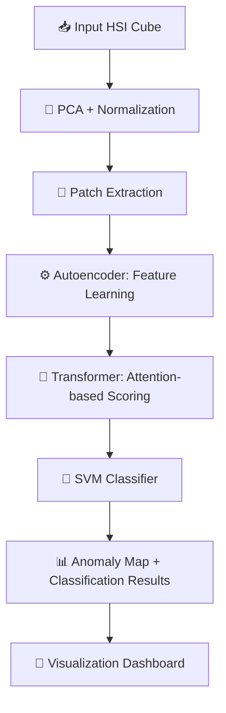

<!-- README.md -->

<div align="center">

# 🛰️ **HYPERSPECTRAL ANOMALY DETECTION**


</div>

---

## 🚀 Project Overview
**AnomVisor** is an advanced **Hyperspectral Anomaly Detection System** integrating deep learning and traditional machine learning.  
It combines:
- 🧠 **Autoencoder (AE)** for deep feature extraction  
- ⚡ **Transformer** for spatial–spectral attention  
- 🎯 **SVM** for anomaly classification  

The system works on **hyperspectral cubes** like *Pavia University*, *Indian Pines*, and *Salinas Scene*, performing:
> Preprocessing → Patch Extraction → Autoencoder → Transformer → SVM → Anomaly Map Visualization

---

## ✨ Key Highlights
- ✅ Complete pipeline for detection & classification  
- 🧩 Modular architecture with customizable patch size and PCA  
- ⚙️ Transformer attention-based scoring  
- 🌈 Real-time anomaly visualization (heatmap & overlay)  
- 📈 Integrated accuracy, precision, recall, F1 metrics  

---

## 🧱 Folder Structure
```bash
AnomVisor/
├── backend/                   # Model code, training, evaluation
├── frontend/                  # UI for user interaction
├── MODEL_ARCHITECTURE.md      # Architecture explanation
├── MODEL_COMPLETE_FLOW.md     # Pipeline flow description
├── Final__New_detection.ipynb # Full notebook demo
├── requirements.txt           # Dependencies
└── README.md                  # You are here
```
## Installation
#### Clone the Repo
```
git clone https://github.com/KrishnaGupta2403/AnomVisor.git
cd AnomVisor
```
#### Create & activate a virtual environment
```
python -m venv venv
venv\Scripts\activate      # On Windows
# or
source venv/bin/activate   # On Mac/Linux
```
#### Install dependencies
```
pip install -r requirements.txt
```
#### Run the notebook or backend script
```
jupyter notebook Final__New_detection.ipynb
# OR
python backend/train_pipeline.py --config config.yaml
```
## Model Flow

