```mermaid
flowchart TD
    A[📥 Input HSI Cube] --> B[🧮 PCA + Normalization]
    B --> C[🧩 Patch Extraction]
    C --> D[⚙️ Autoencoder: Feature Learning]
    D --> E[🔁 Transformer: Attention-based Scoring]
    E --> F[🧠 SVM Classifier]
    F --> G[📊 Anomaly Map + Classification Results]
    G --> H[🎨 Visualization Dashboard]
```

<!-- README.md -->

<div align="center">

# 🛰️ **SarvekshanSaathi**
### *Hyperspectral Anomaly Detection Studio*


</div>

---

## 🚀 Project Overview

**SarvekshanSaathi** is a state-of-the-art **Hyperspectral Anomaly Detection System** designed to identify irregularities in complex remote sensing data. By fusing deep learning with traditional machine learning, it offers a robust pipeline for detecting anomalies in hyperspectral cubes.

The system leverages a hybrid architecture:
- **🧠 Autoencoder (AE):** Compresses high-dimensional spectral data to extract robust features.
- **⚡ Transformer:** Captures long-range spatial-spectral dependencies.
- **🎯 SVM Classifier:** Delivers precise anomaly classification based on the learned features.

Designed for researchers and analysts, the platform supports standard datasets like *Pavia University*, *Indian Pines*, and *Salinas Scene*, providing real-time visualization of anomaly maps.

---

## ✨ Key Features

### 🔬 Advanced ML Pipeline
- **Hybrid Architecture:** Combines the feature extraction power of Autoencoders and Transformers with the classification precision of SVMs.
- **Customizable:** Modular design allows for adjustable patch sizes and PCA components.

### 💻 Modern Interactive Frontend
- **Orbiting Workflow Animation:** A visually stunning, real-time representation of the processing pipeline.
- **Dual Theme Support:** Fully responsive **Light** and **Dark** modes for comfortable viewing in any environment.
- **Interactive Workspace:** Drag-and-drop file upload for `.mat` hyperspectral cubes and ground truth files.
- **Visual Analytics:** Side-by-side comparison of anomaly maps, confusion matrices, and PCA composites.

---

## 🛠️ Tech Stack

### **Frontend**
- **React.js:** Component-based UI architecture.
- **GSAP:** High-performance animations (Orbiting Workflow).
- **Three.js:** 3D visualizations and effects.
- **CSS3:** Custom responsive styling with glassmorphism effects.

### **Backend**
- **Python:** Core logic and model implementation.
- **Flask:** REST API for serving the model and handling requests.
- **TensorFlow / PyTorch:** Deep learning framework for Autoencoder and Transformer models.
- **Scikit-learn:** SVM implementation and metrics.

---

## 🧱 Folder Structure

```bash
SarvekshanSaathi/
├── backend/                   # Flask API, Model training & inference logic
├── frontend/                  # React application source code
│   ├── src/
│   │   ├── components/        # Reusable UI components (OrbitingWorkflow, etc.)
│   │   └── App.css            # Global styles and themes
├── Final__New_detection.ipynb # Jupyter Notebook for model experimentation
├── requirements.txt           # Python dependencies
└── README.md                  # Project documentation
```

---

## 🚀 Getting Started

### Prerequisites
- Node.js (v14+)
- Python (v3.8+)

### 1️⃣ Backend Setup

1.  **Navigate to the project root:**
    ```bash
    cd SarvekshanSaathi
    ```

2.  **Create and activate a virtual environment:**
    ```bash
    # Windows
    python -m venv venv
    venv\Scripts\activate

    # Mac/Linux
    python3 -m venv venv
    source venv/bin/activate
    ```

3.  **Install Python dependencies:**
    ```bash
    pip install -r requirements.txt
    ```

4.  **Start the Backend Server:**
    ```bash
    # Assuming app.py or similar entry point in backend/
    python backend/app.py
    ```
    *Ensure the backend is running on `http://127.0.0.1:5000`.*

### 2️⃣ Frontend Setup

1.  **Navigate to the frontend directory:**
    ```bash
    cd SarvekshanSaathi/frontend
    ```

2.  **Install Node modules:**
    ```bash
    npm install
    ```

3.  **Start the Development Server:**
    ```bash
    npm start
    ```
    *The application will open at `http://localhost:3000`.*

---

## 📊 Model Flow



---

## 🤝 Contributing

Contributions are welcome! Please feel free to submit a Pull Request.

---

## 👥 Contributors

<div style="display: flex; align-items: center; gap: 10px;">
  <a href="https://github.com/KrishnaGupta2403">
    
  </a>
  <a href="https://github.com/kartik-kumar-pandey">
    
  </a>
  
  <span style="font-weight: 600; font-size: 1.1em;">
    Bhumika Mishra &nbsp;•&nbsp; Janvee &nbsp;•&nbsp; Prerna Sahu &nbsp;•&nbsp; Aditi Khare
  </span>
</div>
---

<div align="center">
  <p>Made with ❤️ by the SarvekshanSaathi Team</p>
</div>
